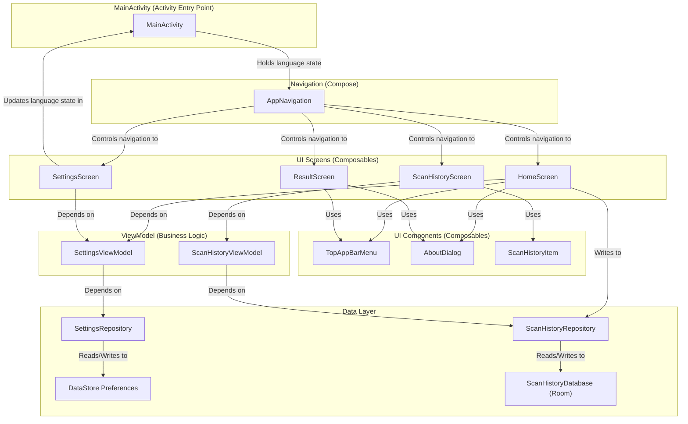

# Simple Barcode Scanner

Simple Barcode Scanner is a lightweight yet powerful utility for Android, designed to provide a seamless and intuitive barcode scanning experience. Built entirely with modern, native Android technologies, the app offers a clean, responsive, and user-friendly interface for decoding a wide array of barcode formats. Its primary function is to quickly scan and parse data, with a special focus on formatting complex information, such as the data from a driver's license, into a human-readable format.

The application is architected using the latest best practices recommended by Google. The entire user interface is crafted with Jetpack Compose and Material 3, creating a fully declarative and dynamic user experience. At its core, the scanning capability is powered by Google's ML Kit Vision library, ensuring fast and accurate barcode detection. App settings and state are managed reactively using a combination of Jetpack ViewModel and DataStore, which persist user preferences like language and scanner settings efficiently. Navigation is handled cleanly by Compose Navigation, creating a robust single-activity architecture.

### Key Features:
*   **Multi-Format Scanning:** Supports a wide variety of formats, including QR Code, PDF417, UPC, EAN, Data Matrix, and more.
*   **Driver's License Parsing:** Intelligently formats the complex data from AAMVA-compliant driver's licenses into an easily readable list.
*   **Dynamic Language Support:** Instantly switch between English, Spanish, Italian, and Ukrainian without restarting the app.
*   **Modern UI:** A clean and intuitive interface built with the latest Material 3 design principles.
*   **User Settings:** Includes options to enable or disable the scanner's auto-zoom feature.
*   **Share Functionality:** Easily share the raw, unformatted data from any scanned barcode.

### Architecture

